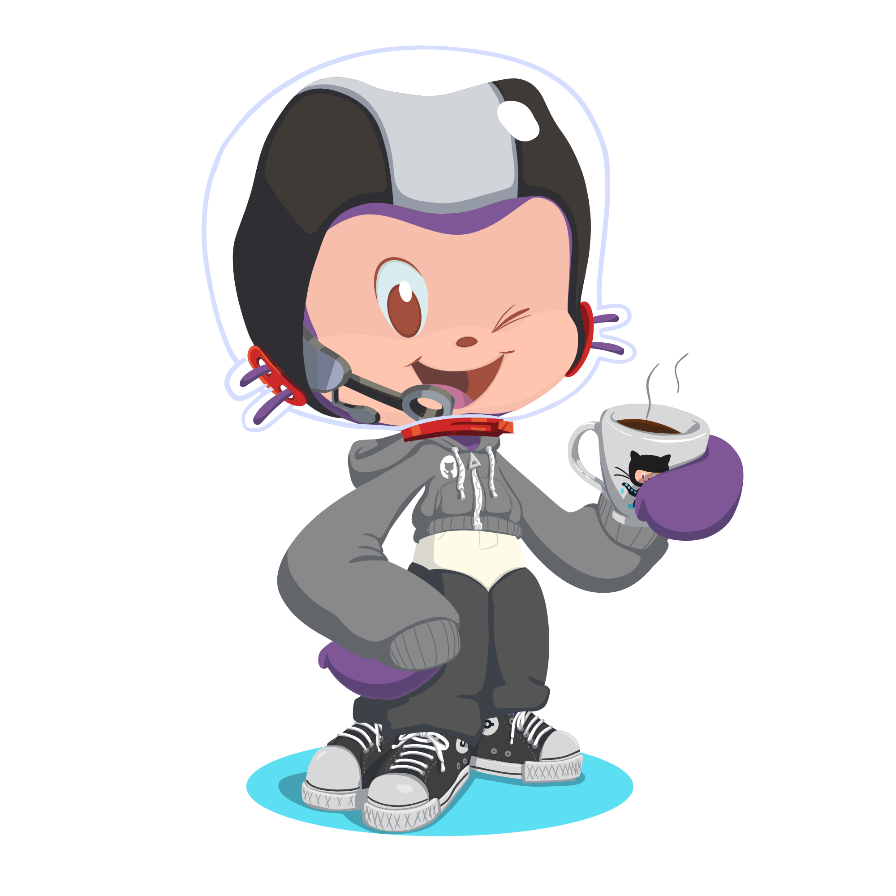
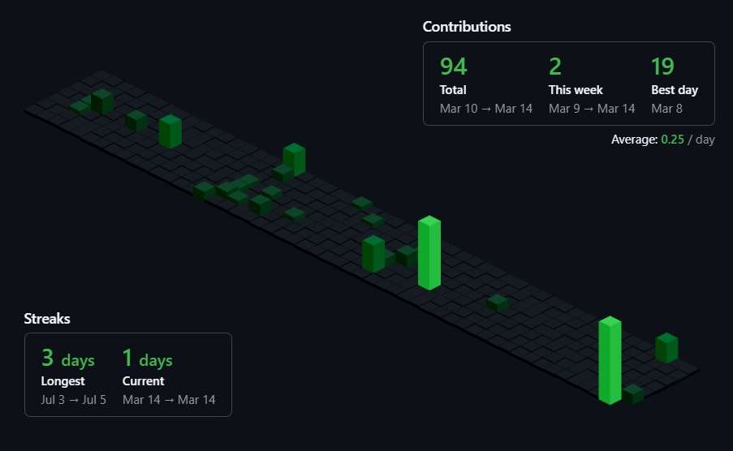

 

  

I’m a **second-year Computer Science Engineering student** with a deep passion for **technology and innovation**! 🚀 My journey in tech is all about exploring new domains, constantly learning, and refining my skills to find my niche. Currently, I’m diving into **Data Structures and Algorithms in Java**, sharpening my problem-solving abilities while working on exciting real-world projects. I love the thrill of **building, debugging, and optimizing applications**—turning ideas into reality! Beyond coding, I have a creative side too—I enjoy **graphic design and UI enhancements**, because great design makes everything better! Whether it’s tackling complex problems, experimenting with new technologies, or perfecting visual details, I’m always up for a challenge!

### - 📫 Email: **tejinderk.2004@gmail.com**  
### - ⚡ Fun fact: **I have a love-hate relationship with semicolons—sometimes they save my code, sometimes they break it! 😆**  

---

## ⚒️ Languages, Frameworks & Tools  

  

---

## 📝 My Github Stats
<table>
  <tr>
    <td colspan="2" align="center">
      
    </td>
  </tr>
  <tr>
    <td align="center">
      
    </td>
    <td align="center">
      
    </td>
  </tr>
  <tr>
    <td colspan="2" align="center">
   
    </td>
  </tr>
</table>

ismein apni id daal de meri ki jagein you will get the stats of your profile in form of badges and graph

    
  </a>

## 🎖️ My Badges  

  

---

## 🤝 Let's Connect!  
<!---->
&nbsp;&nbsp;

---

<!--## Hi there 👋
# ✨ Hey there, I'm Tejinder! 👋  
 

## 😃 About Me  
- 🎓 Pursuing **Computer Science Engineering (CSE)** (2nd Year).  
- 🔥 Passionate about **learning new technologies** and **exploring domains**.  
- 🏗️ Building cool stuff, one **commit** at a time!  
- 💻 Currently focused on **Data Structures & Algorithms in Java**.  
- 🎨 Occasionally lost in **graphic design & UI tweaks**.-->  
<!--
**Tejkaur04/Tejkaur04** is a ✨ _special_ ✨ repository because its `README.md` (this file) appears on your GitHub profile.

Here are some ideas to get you started:

- 🔭 I’m currently working on ...
- 🌱 I’m currently learning ...
- 👯 I’m looking to collaborate on ...
- 🤔 I’m looking for help with ...
- 💬 Ask me about ...
- 📫 How to reach me: ...
- 😄 Pronouns: ...
- ⚡ Fun fact: ...
-->
